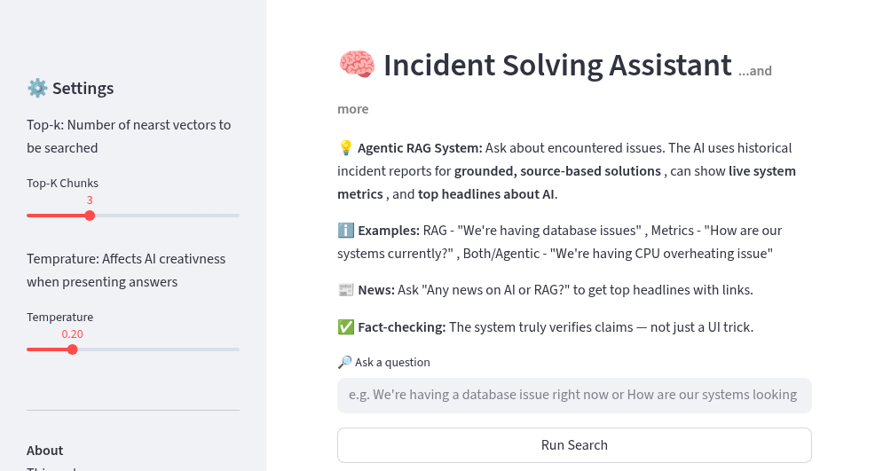

# PG-RAG-TC(Production Grade Retrieval-Augmented Generation with tool calling)

A production-style Retrieval-Augmented Generation (RAG) system with chunking, embedding, vector search, and evaluation, designed to minimize hallucinations and operate under real-world constraints. The historiacal data used for this project is a sample json data.

- The system is Agentic in the sense that it can choose what actions to take based on user query, and that the actions or agents can interact with each other. There are currently two actions it can choose from. Get live system metrics(mock) and give a solution based on historical incident reports
- The provided solution is controlled for hallucinations to ensure the response is factual.

The web version of the tool can be found here: [ragincident:](https://ragincident.streamlit.app/)

# Tech stack

- Code: python
- Embedding: Gemeni
- Vector Store: FAISS
- LLM: Gemini
- Storage: JSON, index, pickle
- Tool/Function Calling: Gemeni. Optionally Langchain
- Evaluation: Python
- GUI: Streamlit
- Virtual Environment: venv
- Hallucination Control: Input guard rails, NLI-based hallucination control

# Building process step-by-step

# Phase 1: RAG

1. Load JSON data. Transfrom Data into one big text
2. Chunking: Break text into smaller chunks. Chunk size in this case is 80, which corresponds to about 80 words. Overlapp is set to about 10 words. 50 chunks in total.
3. Evaluation: chunking and overlapp is evaluated by doing a sanity check and overlap inspection.
4. Embedding: Embed the chunks using a Gemini embedding model. Batch embedding(batches of 10) is implemented for effectiveness. Each embedding has about 3072 dimensions.
5. Storing: Store embeddings in a vector store(vector database) using FAISS
6. Query & Search: Turn the user query into an embedding, then do a semantic search that leverages ANN(Approximate Nearest Neighbour) to find the closest(most similar) vectors in the database.
7. RAG: Implement a Gemini LLM model with predifined prompt that uses the vector database as context for its answer. The answer received is affected by the user's choice of top-k and temperature. Top-k =  number of nearest neighbours. Temperature = precison
8. GUI: Use streamlit(or any other method) to implement a simple GUI.
Final UI:

# phase 2: Make the system more Agentic by implementing tool calling

The framework langchain was initially used for tool calling, but was later swapped to Gemini's function calling.
This was done because Langchain felt like overkill for a limited project such as this, and we have already installed and are in use of Gemeni.
The goal here is to make the system automatically pick what actions to perform based on the user query, and the results from one action can be passed down and used for another action, making the model truly agentic.

- Gemini function calling is used for adding the tools
- Currently, the system can choose between 3 actions. Get live system metrics(mock) and/or show step-by-step solution to issues based on historical incidents
- The third tool retrieves top news about AI and RAG, with their sources included. This is done using a free public api from Hacker news(angolia).
- "tenacity" library was used to prevent crashes, and allow timeouts and retries, but that part of the code has been commented out due to inferred response latency.
- The tool-calling mechanism is scalable, so more tools can easily be added in the future per necessity.

# phase 3: Hallucination control

There are many ways to implement hallucination control. Ideally, it is best to have a combination of multiple strategies.
Hallucination control is used for fact checking the generated respons against the results of the agents. The strategies used for hallucination control so far are the following

1. Using strict pre-prompts(Input guard rails) that command the model to ONLY use the given context, to never guess, or use external knowledge.
2. NLI(Natural Language Interface)-based hallucination control, which is where we use a Gen model to fact-check the generated response using the retrieved chunks. We give the fact checker the role of a strict audior or something similar.

- To properly control the NLI, the first method (input guard rails) is removed so the response includes some hallucinations on purpose.
- The fact checker responds with "Supported", "PARTIALLY_SUPPORTED", or "UNSUPPORTED". If it is partially unsupported, the reason is also explained in the response. The result of the fact checker is displayed in the frontend below the answer. 
- ### OBS: NLI-based hallucination control can be less cost-friendly since it makes an additional request to fact-check the response
  More strategies to be added in the future, but this is good for now. Hallucination control has been tested and works well 👍
